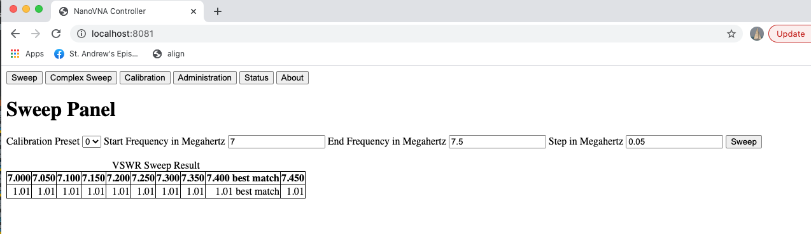
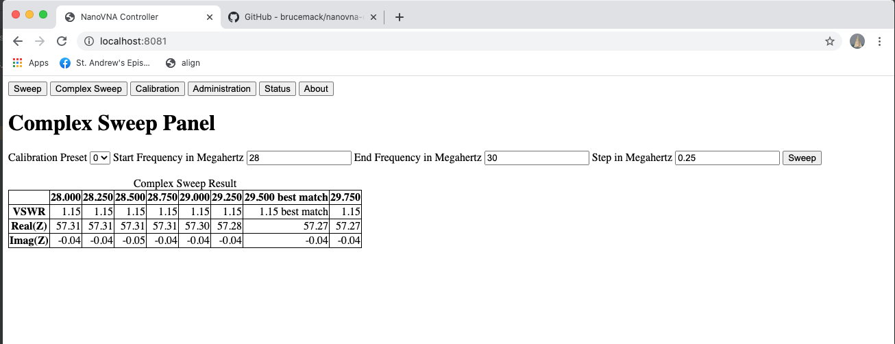
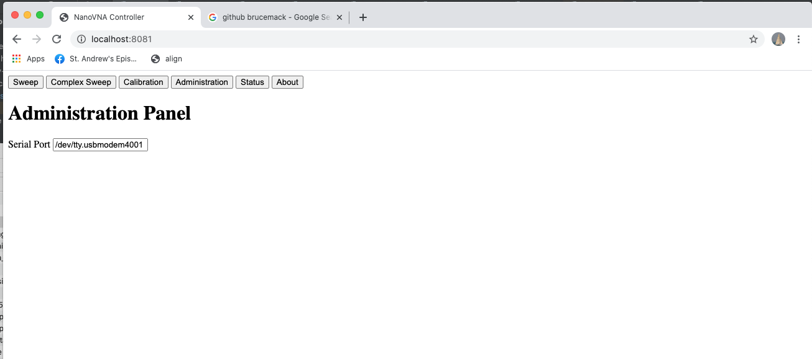
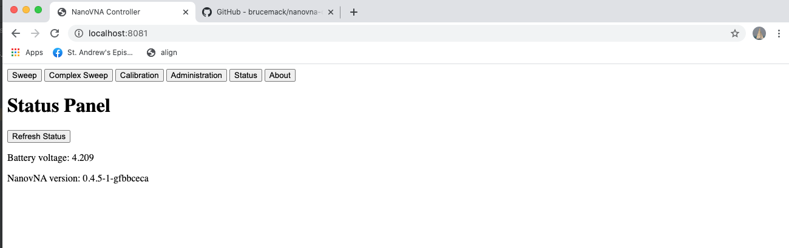

Overview
========
This is a simple control interface for the NanoVNA.  An HTML interface is provided 
that allows the user to perform VSWR sweeps of antennas or other devices.  Calibration is also possible using the interface.

Why an HTML interface?  Among other reasons, this makes the NanoVNA compatible with screen reader technology.

This program was designed by N1FMV and KC1FSZ.

Precise Installation Instructions (Windows)
===========================================
* Download nanovna-controller.zip from the release area: https://github.com/brucemack/nanovna-controller/releases
* Unzip the file.  This will create a base folder that contains the .exe, the config.ini file, and a static folder.  For example: C:\nano.
* Edit the config.ini file in the base folder:
  - Set the workdir to a location where you'd like to store working files created by the controller (i.e., user config files)
  - Set the TCP port you want to listen on for HTTP connections.
* Open a command prompt.
* Run the nanovna-controller.exe passing an argument of the base folder.  For example:

            nanovna-controller c:\nano

* Point your browser to http://localhost:8081.  Or use whatever port number you have configured in the config.ini file.
* Use the Administration tab to configure the serial port where the NanoVNA is connected.

Precise Installation Instructions (LINUX)
=========================================

Follow these instructions the first time you are installing/running the controller:

* Make sure you have a Git client installed.
* Make sure you have Python 3.7.3 or greater installed.
* Clone the Github repo and change into the project directory:

      git clone git clone https://github.com/brucemack/nanovna-controller.git
      cd nanovna-controller
* The location of your repo is called the base directory. 
* Setup a Python virtual environment (called dev in this case):

      python3 -m venv dev
* Activate the virtual environment by sourcing the activate script:

      . dev/bin/activate
* Install the required Python packages:

      pip install -r requirements.txt
* Edit the config.ini file in your base directory:
  - Set the work directory to a location where you'd like to store working files created by the controller (i.e., user config files)
  - Set the TCP port you want to listen on for HTTP connections.
* Launch the server by running main.py.  Pass the location of your base directory, which is most likely the current directory: 

      python main.py .
* Point your browser to http://localhost:8081.  Or use whatever port number you have configured in the config.ini file.
* Use the Administration tab to configure the serial port where the NanoVNA is connected.  On Linux this would typically be something like /dev/ttyACM0.
* Use the Status tab to validate that the NanoVNA is connected and responding to commands.

Once everything is installed the first time you can run it using these commands:

      cd nanovna-controller
      . venv/bin/activate
      python main.py .

NanoVNA Technical Information
============================
The data command causes the NanoVNA to return a list of reflection coefficients in real/imaginary pairs.  Each line contains one coefficient and the real/imaginary parts are space-delimited.

Gamma is the magnitude of the complex reflect coefficient.

VSWR = (1+Gamma)/(1-Gamma)

One Time Setup For Development
==============================
On Windows:

      python -m venv dev
      dev\Scripts\activate.bat
      python -m pip install --upgrade pip
      pip install -r requirements-windows.txt

Running (Development Mode)
==========================
Windows, command-line, development:

      python main.py

Building Requirements
=====================
* pyserial - For serial communications to the NanoVNA
* Flask - Needed for web serving
* numpy

PyInstaller Packaging
=====================

* pip install PyInstaller
* pyinstaller --onefile main.py --name nanovna-controller

The .exe will end up in /dist
Zip the .exe, config.ini, and the static folder together.

Resolving Issues with PyInstaller Virus Detection
-------------------------------------------------
Many anti-malware tools have a problem with the pre-built bootloader
shipped in the standard PyInstaller distribution.  The work-around 
is to pull the source distribution of PyInstaller and build the 
bootloader locally.

* git clone https://github.com/pyinstaller/pyinstaller.git
* cd pyinstaller
* cd bootloader
* python ./waf all
* Switch to the nanovna-controller virtual environment
* pip install c:/Users/bruce/git/pyinstaller

Links
=====
* Prototype UI: https://brucemack.github.io/nanovna 
* NanoVNA command reference: https://4ham.ru/wp-content/uploads/2020/05/NanoVNA_Console_Commands_Dec-9-19-1.pdf

Change Notes
============

Version 4
---------
* If the user has not explicitly defined a serial port, we now default to use the first USB serial port found on the machine (but not COM1).  (Thanks to Chris VE3RWJ)
* Other logging cleanups to cut down on clutter
* Removed the numpy work-around since Windows 10 has cleaned up the fmod error.

Version 3
---------
* Major rework of calibration process.
* Cleaned up some of the noise on the console window at startup.
* Automatically stripping spaces from serial port entry on administration tab.
* If a single number is entered into the serial port box, automatically add the "com" prefix.
* Fixed problem with complex impedance.  Now showing real and imaginary components.
* Using locally-compiled PyInstaller bootloader to avoid issues with Windows Threat Detection.

Version 2
---------
* Defaults to COM6
* Able to auto-sense the base dir
* Error checks for config.ini and static dir
* Changing numpy version to address Windows bug

Version 1
---------
* Initial version

Screenshots
===========

Here are some pictures of what the HTML screens look like.  You might be thinking 
that the UI is not very impressive, but please keep in mind that 
one of the design objectives was to create an application that is easy to use
for visually-impaired operators.  The HTML has been structured 
using semantic mark-up and ARIA tags so that it can be integrated smoothly with 
the Microsoft Narrator screen reader.  I am new to this technology but I find it
quite interesting.  I would welcome comments from people with more experience in 
this area.

The sweep panel:

The complex sweep panel:

The administration panel:

The status panel:

